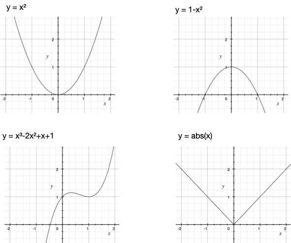
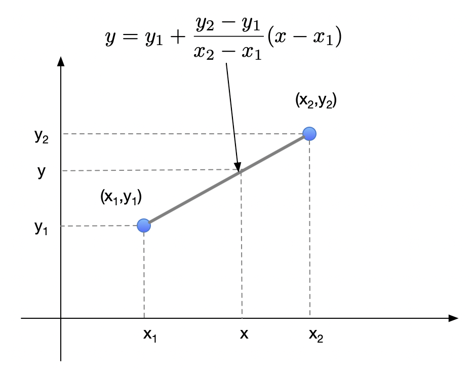
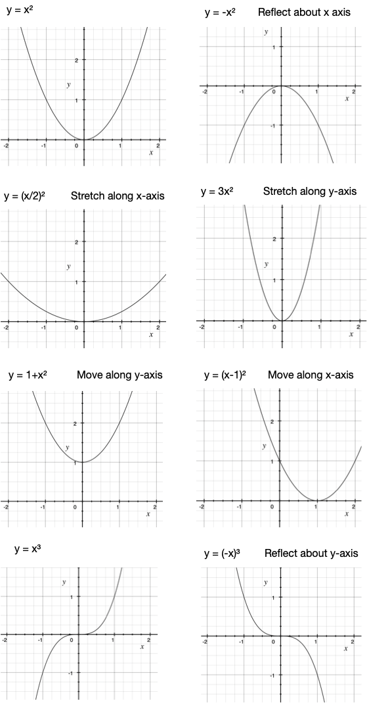
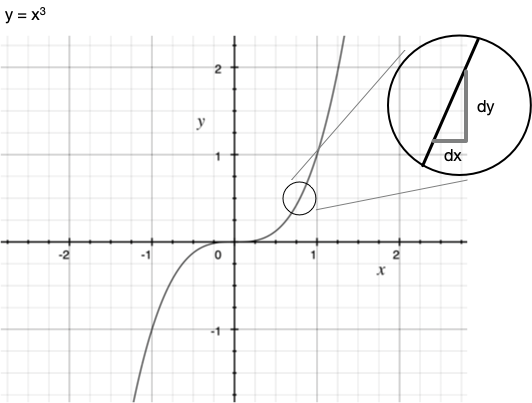
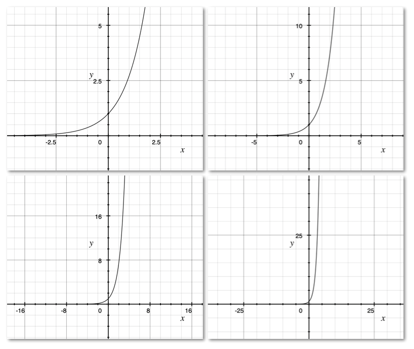
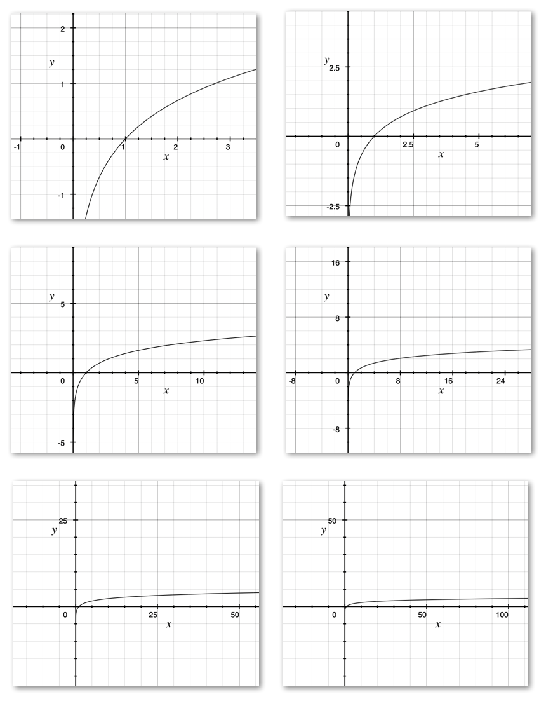
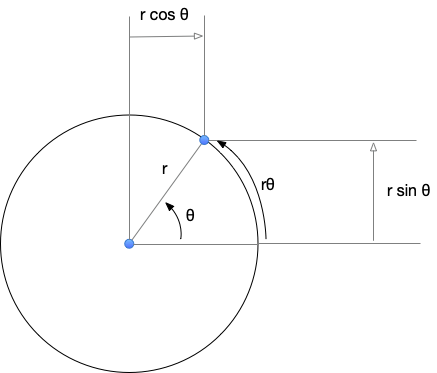
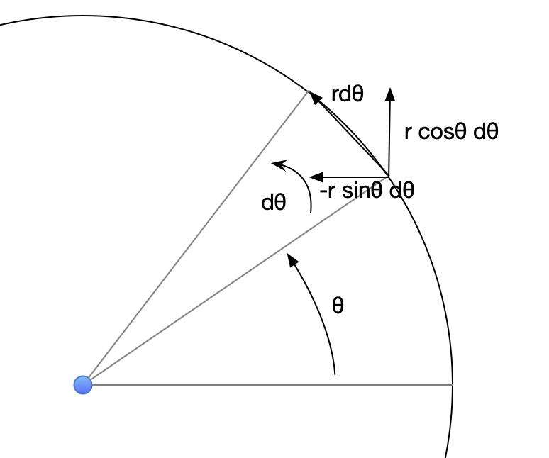

Mathematical preliminaries
==========================

While the course does not demand heavy use of math, when writing programs that
make noises based on principles, math does become the means through which the
sounds are constructed and understood. The basic math needed to do interesting
things with sound and to make interesting sounds is not much and this section
introduces you to what is needed. We may extend this a little bit through the
course.

Functions
---------

For our purposes, functions are expressions that calculate result values given
one or more input values. In other words, they *map* input values to result
values. You would've encountered them in grade X.

If :math:`f` is a function that calculates a result value :math:`y` given 
input :math:`x`, we write :math:`y = f(x)`. Some examples are shown below.

   Some examples of functions that take a number and compute
   another number. These are best shown as an X-Y plot.

In a programming language like python, you can express these functions
in more or less the same form, apart from syntax.

.. code-block:: python

    def f1(x):
        return x * x

    def f2(x):
        return 1 - x * x

    def f3(x):
        return math.abs(x)

    def f4(x):
        return x**3 - 2 * x**2 + x + 1

Linear interpolation
--------------------

If I tell you that a function takes a value :math:`y_1` at :math:`x_1` and
:math:`y_2` at :math:`x_2`, and in between :math:`x_1` and :math:`x_2` it looks
like a straight line, we call it a "linear interpolation" -- i.e. we're
expressing the value of the function in between ("inter") :math:`x_1` and
:math:`x_2` as a straight line that connects two points in the X-Y plane
("linear").

.. math::

    f(x) = y_1 + \frac{y_2 - y_1}{x_2 - x_1}(x - x_1)

If you substitute :math:`x = x_1`, you can see that :math:`f(x) = y_1` and if
you substitute :math:`x = x_2`, you can see that :math:`f(x) = y_1 + y_2 - y_1
= y_2`. So it meets both end point values we stated earlier. We can also see
that the change in :math:`f(x)` for a given change in :math:`x` is proportional
to the change in :math:`x`.

   Linear interpolation between :math:`(x_1,y_1)` and :math:`(x_2,y_2)`.

Common simple transformations of functions
------------------------------------------

Given a function :math:`f(x)`, we can make a related family of functions by
stretching, shrinking, reflecting and moving it up or down along the two axes.

   Given a function :math:`y= x^2`, we can generate variations by stretching,
   shrinking, reflecting and moving it up or down quite easily.

Shifting a function to another point along the x axis
^^^^^^^^^^^^^^^^^^^^^^^^^^^^^^^^^^^^^^^^^^^^^^^^^^^^^

Suppose we have a function :math:`f(x)` given and we want to determine 
another function :math:`g(x)` whose picture is basically the same as
that of :math:`f(x)`, but shifted :math:`a` units to the right, can we
express :math:`g(x)` in terms of :math:`f(x)`? This forms a simple
relationship that we'll need pretty heavily through this course
as we write our programs that shift sound in time or frequency.

The relationship between :math:`f` and :math:`g` is simply this --

.. math::
    
    g(x) = f(x - a)

So if you're given :math:`f(x) = x^2` and you want to move the parabola
rightwards by :math:`3` units, you simply write :math:`g(x) = (x-3)^2`.

Shifting a function up or down the y axis
^^^^^^^^^^^^^^^^^^^^^^^^^^^^^^^^^^^^^^^^^

To shift a function :math:`f(x)` by an amount :math:`a` up the y-axis, you
simply add :math:`a` to it.

.. math::

    g(x) = f(x) + a

Reflecting a function around the x and y axes
^^^^^^^^^^^^^^^^^^^^^^^^^^^^^^^^^^^^^^^^^^^^^

Given an :math:`f(x)`, if you want to make a :math:`g(x)` whose
picture is the same as that of :math:`f(x)` but mirrored around
the y-axis, you simply do this --

.. math::

    g(x) = f(-x)

Reflecting about the x-axis is simply a negation --

.. math::
 
    g(x) = -f(x)

Stretching and shrinking a function
^^^^^^^^^^^^^^^^^^^^^^^^^^^^^^^^^^^

If you want to stretch or shrink a function along the y-axis without
changing it in the x direction, you just need to multiply (i.e. "scale")
it by a constant value :math:`a`. If :math:`0 < a < 1`, the picture
will shrink in the y direction and if :math:`a > 1`, the picture will
stretch in the y direction.

.. math::
    
    g(x) = a f(x)

If you want to stretch a function in the x-direction by a factor :math:`a`,
you can do this --

.. math::

    g(x) = f(\frac{x}{a})

If :math:`a > 1`, you'll get :math:`g`'s picture to be a horizontally
stretched version of :math:`f`'s picture. If :math:`0 < a < 1`, you'll get
:math:`g`'s picture to be compressed/shrunk version of :math:`f`'s picture
along the x direction.

Basic calculus useful for this course
-------------------------------------

We won't need to deal with calculus in the mathematically rigorous/onerous
sense (depending on your perception). We'll however need an intuitive grasp
that's sufficient for us to write programs that make use of calculus
principles. This section introduces what you need, and only what you need.

.. note:: I'll be appealing to your intuition at times. In case that appeal
   turns out to be unworkable, let me know and I'll help you through it and
   revise the material appropriately.

.. admonition:: Key idea behind calculus

    Calculus is based on the observation that if you look at a small part of a
    smooth curve with a magnifying glass, it will look roughly like a straight
    line.

   Calculus is based on local linear approximation of functions.

Notation-wise, when we write :math:`dx`, we mean "a little bit of x". So in the
figure above, the ratio :math:`\frac{dy}{dx}` is the ratio of the little bit of
change in :math:`y` (:math:`dy`) produced by a little bit of change in
:math:`x` (:math:`dx`). This ratio is called the "derivative of :math:`y`
with respect to :math:`x`". The derivative captures the idea of the rate of
change of one quantity w.r.t. another quantity it depends on.

For example, consider the function :math:`f(x) = x^2 - 3x`. If we want to
determine by how much :math:`f` changes when we change :math:`x` by "a little bit"
:math:`dx`, we're interested in :math:`df` where :math:`f(x+dx) = f(x) + df`.

For our given function, 

.. math::
    \begin{array}{rcl}
    f(x+dx) &=& (x+dx)^2 - 3(x+dx) \\
    &=& x^2 + (2x)dx + dx^2 - 3x - 3dx \\
    &=& x^2 - 3x + (2x-3)dx
   \end{array}

That means, :math:`df = (2x-3)dx` and so :math:`df/dx = 2x-3`. Here, we're
ignoring :math:`dx^2` because it is too small for us to pay attention to -- it
is a tiny fraction of a little bit of :math:`x`!!

This calculation is easily translated into a python program as follows --

.. code-block:: python

    def approx_derivative(f, dx):
        return (f(x + dx) - f(x)) / dx

Going the other way, if we add lots of "little bits of :math:`x`" together,
we expect to get .... :math:`x`!! This computation of "adding lots of little
bits of a quantity" is called the "integral". If you think of the integral
as an elongated "S" for "summation", we can write -

.. math::

    \int_{x_1}^{x_2}dx = x_2 - x_1

Above, we're adding all the little bits of :math:`x` between :math:`x_1` and
:math:`x_2`. Since we've accounted for everything between :math:`x_1` and
:math:`x_2` by doing that, what we have at hand at the end is simply :math:`x_2
- x_1`.

Similarly, if we have :math:`f(x) = x^2` and we want to add up all the little bits
of f (i.e. :math:`df`) corresponding to the little bits of :math:`x` between
:math:`x_1` and :math:`x_2`, we expect to get :math:`f(x_2) - f(x_1) = x_2^2 - x_1^2`.

.. math::

    \int_{x_1}^{x_2}df = f(x_2) - f(x_1)

Since we know :math:`df = 2xdx`, we have --

.. math::

    \int_{x_1}^{x_2}2xdx = {x_2}^2 - {x_1}^2

If we wish to not pay attention to the two points between which we're summing
up the little bits of :math:`f`, we can be sloppy and write the same thing this
way --

.. math::

    \int{2xdx} = x^2

To put it a bit more generally, 

.. math::

    \int_{x_1}^{x_2}\frac{df}{dx}dx = \int_{x_1}^{x_2}df = f(x_2) - f(x_1)

Conversely to the derivative, the integral :math:`\int_{x_1}^{x_2}f(x)dx` can
be written as a summation loop in python.

.. code-block:: python

    def approx_integral(f, x1, x2, dx):
        result = 0.0
        for x in arange(x1,x2,dx):
            # Add up the little bits of changes 
            # described by the rate f(x).
            result = result + f(x) * dx
        return result

Derivatives of transformed functions
------------------------------------

A few things listed below are useful to know here w.r.t. transformed functions.
Here, we use the notation :math:`f'(\text{something})` to denote the ratio of
the "little bit of change in :math:`f` to the little bit change
in :math:`\text{something}` that gave us that change in :math:`f`.

.. math::

    \begin{array}{rcl}
    \frac{d}{dx}f(x-a) &=& f'(x-a) \\
    \frac{d}{dx}(kf(x)) &=& k f'(x) \\
    \frac{d}{dx}f(kx) &=& k f'(kx) \\
    \frac{d}{dx}f(x/k) &=& \frac{1}{k} f'(x/k)
    \end{array}

In words,

1. The derivative of a shifted function is the same as the derivative of the
   original function at the shifted position.

2. The derivative of a function scaled in the y axis is the same as the
   derivative of the function scaled by the same factor.

3. The derivative of a function scaled in the x direction is the same
   as the derivative of the function at the scaled position, divided
   by the scaling factor.

All of the above are instances of what is called the "chain rule" which
is applicable when you're calculating the derivative of the composition
of two functions.

.. math::

    \begin{array}{rcl}
    df(g(x)) &=& f'(g(x)) g'(x) dx
    \end{array}

All that is saying is that when you change :math:`x` by a little bit, then
:math:`g` changes by :math:`g'(x)dx`. So now that change becomes the change in
the input to :math:`f`, which will then change by :math:`f'(g(x))g'(x)dx`.

If we're to write that as a program, we can write it in two ways that should
yield approximately the same answers (subject to numerical errors).

.. code-block:: python

    def direct_derivative_of_composition(f, g, x, dx):
        # To compute derivative of f(g(x)).
        dg = g(x+dx) - g(x)
        df = f(g(x) + dg) - f(g(x))
        return df/dx

    def chain_rule(f, g, x, dx):
        gprime = approx_derivative(g, x, dx)
        fprime = approx_derivative(f, g(x), dg)
        return fprime * gprime 

Basic dynamics
--------------

Calculus is most useful to represent, understand and calculate things
about motion - i.e. dynamics.

For something moving at a constant velocity :math:`v`, its dynamics are
represented using :math:`dx = v dt`. All that is saying is that when a little
bit of time elapses, the position changes by a little bit that is proportional
to the elapsed time by a constant factor :math:`v`. If you let this :math:`v`
vary with time, then we have a system whose velocity is changing with time.
In that case, we have :math:`dx = v(t)dt`.

So when you have a known function :math:`v(t)`, you can calculate the
position of the entity given a starting position at :math:`t = 0` using
the following program -- which basically adds up all the little bits
of changes to the position to arrive at the final position.

.. code-block:: python
    
    def approx_position(v, t, dt, x0):
        x = x0
        for tstep in arange(0, t, dt):
            x = x + v(tstep) * dt
        return x

One may then also ask "how do we describe :math:`v` changing with time?".
If :math:`v` is itself changing at a constant rate :math:`a`, we write
:math:`dv = a dt`. For such a system, to find out where it will be at a given
point in time, we need to know both its starting position *and* its
starting velocity. We can use a similar approach to find out the approximate
position in this case too, as shown below --

.. code-block:: python
    
    def approx_position(a, t, dt, x0, v0):
        x = x0
        v = v0
        for tstep in arange(0, t, dt):
            # The current velocity is v, so x changes a little bit.
            x = x + v * dt
            # The current acceleration is a(t), and so the velocity also
            # changes a little bit a little later.
            v = v + a(tstep) * dt
        return x

One interesting case is a system that behaves according to :math:`dx/dt = kx`
for some constant :math:`k`. In this system, the speed with which :math:`x`
changes, is proportional to where it is. If you try and plot such a system by
stepping through in "little bits of :math:`x`", you'll find that for positive
values of :math:`k`, the position very quickly increases enormously and for
negative values of :math:`k`, it always reduces quickly to :math:`0`.

The solution of that dynamical equation is the "exponential function" --
:math:`x = e^{kt}`. To an approximation, you can calculate this function
by adding up little bits of :math:`x` like this --

.. code-block:: python

    def approx_exponential(t, k, dt):
        x = 1.0 # The value at t = 0 is 1.0
        for tstep in arange(0.0, t, dt):
            # add all the little bits of changes
            # to x according to dx = kx dt
            x = x + k * x * dt
        return x

.. note:: The above code is for illustration only and we wouldn't want to
   calculate the exponential function this way due to possible numerical errors
   and running time costs. There are better ways, but the above code
   illustrates the principle behind it.

If :math:`y = e^x`, how do you get :math:`x` given :math:`y`? That function is
called the "natural logarithm" and we write :math:`x = \ln y = \log_e{x}`. The
:math:`\ln` is to be read as "natural logarithm" and is sometimes pronounced
"lawn". In code, when we write :code:`log`, we actual mean "natural logarithm"
as well.

   The exponential function :math:`y = e^x` at different scales.
   Notice that it rises in value very quickly as you move along :math:`x`.

As you see in the figure above, the exponential function grows very fast --
geometrically fast. That is, for every step change in :math:`x`, the function's
value gets *multiplied* by a factor.

   The natural logarithm function at different scales.

The above picture shows the natural logarithm at different scales. It,
being the inverse of the exponential, grows very very slowly with :math:`x`.
Every time you scale :math:`x` by a factor, the :math:`y` value merely
shifts up (additively) by a step.

.. math::

   \begin{array}{rcl}
   e^{a+b} &=& e^a \times e^b \\
   e^{ab} &=& (e^a)^b \\
   ln{ab} &=& ln(a) + ln(b)
   \end{array}

If we instead consider the relation :math:`y = a^x`, we can rewrite
that as :math:`y = e^{ln(a)x}` and therefore we have :math:`x = log_a(y) = ln(y)/ln(a)`. 

Basic trigonometric functions
-----------------------------

We need a few things from trigonometry because the "sinusoidal functions"
play a basic role in construction of sound from more elementary sounds.

The two most basic functions are, as you know, :math:`\cos \theta` and
:math:`\sin \theta`, where :math:`\theta` is an angle in "radians".

   The basic trignonometric functions :math:`\sin \theta` and :math:`\cos
   \theta`.

In the picture above, we've related the two functions to a point along a circle
of radius :math:`r` at an angle of :math:`\theta` w.r.t. the :math:`x` axis.
There is a simple way to represent this "point on a circle of radius :math:`r`"
from which all the trigonometric properties naturally follow. This is using
complex numbers (which, imo, are *simpler* than ordinary "real" numbers in many
ways).

.. note:: Since we chose units for :math:`\theta` such that the length of the
   arc is :math:`r\theta`, it means the angle representing a full rotation is
   :math:`2\pi`, since the circumference of a circle is :math:`2\pi r`. This
   unit is called the "**radian**" and we say that the :math:`\sin` and
   :math:`\cos` functions have a period of :math:`2\pi` radians, since they
   repeat their values every time we come around full circle.

If we represent the point on the circle as the complex number :math:`x + iy`,
then since :math:`x = r\cos \theta` and :math:`y = r\sin \theta`, we have
:math:`x+iy = r\cos \theta + ir\sin \theta = r(\cos\theta + i\sin\theta) = r e^{i\theta}`.

.. note:: A complex numer :math:`x+iy` can represent a point on the X-Y plane.
   The :math:`i` has the property :math:`i^2 = -1`. This means :math:`(a+ib) +
   (c+id) = (a+c)+i(b+d)`, and :math:`(a+ib)(c+id) = (ac-bd) + i(ad+bc)`.

To "rotate" a point about the origin by :math:`\phi`, you take the complex
number representation of the position of the point and multiply it by
:math:`\cos\phi + i\sin\phi`. So you see that :math:`i` represents a
rotation by :math:`90` degrees.

So if you have a point on the circle of radius :math:`1` ("circle of unit radius"
or "unit circle") at an angle of :math:`\theta`, and you want to move it further
by an angle :math:`\phi`, then the final angle will be :math:`\theta + \phi`,
but according to our complex number multiplication rule, 

.. math::

    \begin{array}{rcl}
    \text{pos}(\theta + \phi) &=& (\cos\phi+i\sin\phi)\text{pos}(\theta) \\
    &=& (\cos\phi + i\sin\phi)(\cos\theta+i\sin\theta) \\
    &=& (\cos\phi\cos\theta - \sin\phi\sin\theta) + i(\cos\phi\sin\theta+\sin\phi\cos\theta)
    \end{array}

So we see that -

.. math::

   \begin{array}{rcl}
   \\cos(\phi+\theta) + i\sin(\phi+\theta)
   &=& (\cos\phi\cos\theta - \sin\phi\sin\theta) + i(\cos\phi\sin\theta+\sin\phi\cos\theta) \\
   \cos(\phi+\theta) &=& \cos\phi\cos\theta - \sin\phi\sin\theta \\
   \sin(\phi+\theta) &=& \cos\phi\sin\theta + \sin\phi\cos\theta
   \end{array}

I won't say that this is an "explanation", but this is the easiest way I know
to work out the trigonometric identities for yourself when in need.

How does the position change w.r.t. :math:`\theta`?
---------------------------------------------------

Given :math:`\text{pos}(r,\theta) = r(\cos\theta + i\sin\theta)`, if we change
:math:`\theta` by a "little bit of :math:`\theta`" that we'll call
:math:`d\theta`, we end up at :math:`\text{pos}(r,\theta+d\theta) =
r(\cos(\theta+d\theta) + i\sin(\theta+d\theta))`. We also see that
:math:`\cos(d\theta) = 1` and :math:`\sin(d\theta) = d\theta` to a first
approximation -- i.e. ignoring "tiny fractions of little bit of
:math:`\theta`".

If we then expand that using what we saw before,

.. math::

   \begin{array}{rcl}
   \\cos(\theta+d\theta) &=& \cos\theta\cos(d\theta)-\sin\theta\sin(d\theta) \\
   &=& \cos\theta + (-\sin\theta) d\theta \\
   \sin(\theta+d\theta) &=& \sin\theta\cos(d\theta) + \cos\theta\sin(d\theta) \\
   &=& \sin\theta + (\cos\theta)d\theta
   \end{array}

So, using our :math:`f(x+dx) = f(x) + df`, we see the following --

.. math::

    \begin{array}{rcl}
    \frac{d}{d\theta}\cos\theta &=& -\sin\theta \\
    \frac{d}{d\theta}\sin\theta &=& \cos\theta
    \end{array}

   Rotating by a little bit of :math:`\theta`.

    
